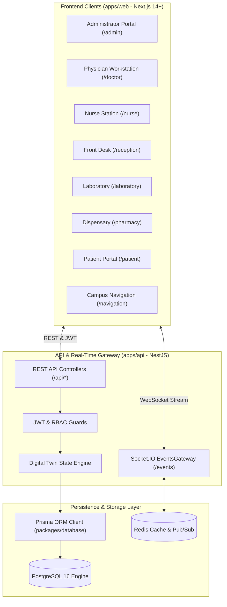

# HospitalOS — System Architecture & Design Document

## 1. Executive Summary

**HospitalOS** is an enterprise-grade, real-time hospital operations and patient journey management platform. It unifies clinical, diagnostic, pharmaceutical, bed management, and administrative workflows into a single cohesive software ecosystem.

The system is engineered as a modern modular monorepo consisting of:
- **`apps/api`**: Modular NestJS backend with REST APIs, WebSocket gateways, and RBAC security.
- **`apps/web`**: Next.js App Router frontend with real-time reactive dashboards for 7 hospital personas.
- **`packages/database`**: Centralized PostgreSQL schema powered by Prisma ORM with 24+ domain models.

---

## 2. High-Level Architecture Diagram



---

## 3. Monorepo Structure

```text
hospitalos/
├── apps/
│   ├── api/                     # NestJS Production Backend
│   │   ├── src/
│   │   │   ├── common/          # PrismaService, Guards, Filters, Decorators
│   │   │   ├── gateways/        # Socket.IO EventsGateway (Real-Time Twin)
│   │   │   ├── modules/         # Auth, DigitalTwin, Queues, Patients, Beds,
│   │   │   │                    # Encounters, Laboratory, Pharmacy, Billing,
│   │   │   │                    # Departments, Doctors, Notifications, Analytics
│   │   │   ├── app.module.ts
│   │   │   └── main.ts          # Swagger docs, CORS, ValidationPipe
│   │   ├── test/                # End-to-end integration tests
│   │   └── Dockerfile
│   │
│   └── web/                     # Next.js App Router Frontend
│       ├── public/
│       ├── src/
│       │   ├── app/             # (admin), (doctor), (nurse), (reception),
│       │   │                    # (laboratory), (pharmacy), (patient), (auth), navigation
│       │   ├── components/      # Navbar, Sidebar, DigitalTwinView, PatientJourneyTimeline,
│       │   │                    # HospitalNavigation
│       │   ├── services/        # Type-safe Axios and Socket.IO API clients
│       │   └── types/           # Domain TypeScript interfaces
│       └── Dockerfile
│
├── packages/
│   └── database/                # Shared Database Package
│       ├── prisma/
│       │   └── schema.prisma    # 24+ Clinical, Administrative & Event models
│       └── prisma.config.ts
│
├── docs/                        # Comprehensive Architecture, Database & API Specs
├── infrastructure/              # Deployment manifests & scripts
├── docker-compose.yml           # Multi-container orchestration (PG, Redis, API, Web)
└── .github/workflows/ci.yml     # Automated CI/CD pipeline
```

---

## 4. Key Architectural Patterns

1. **Deterministic Digital Twin**: The live operational state is directly computed from relational records (active queues, occupied beds, open orders) rather than detached synthetic simulations.
2. **Domain-Driven Modularity**: Each hospital department has an independent NestJS module with isolated service logic and controller endpoints.
3. **Role-Based Access Control (RBAC)**: All routes are guarded by `@UseGuards(JwtAuthGuard, RolesGuard)` and parameterized with `@Roles(Role.DOCTOR, Role.ADMIN)`.
4. **Reactive Real-Time Synchronization**: Changes to beds, tickets, and clinical reports instantly trigger WebSocket broadcast messages to room subscribers.
