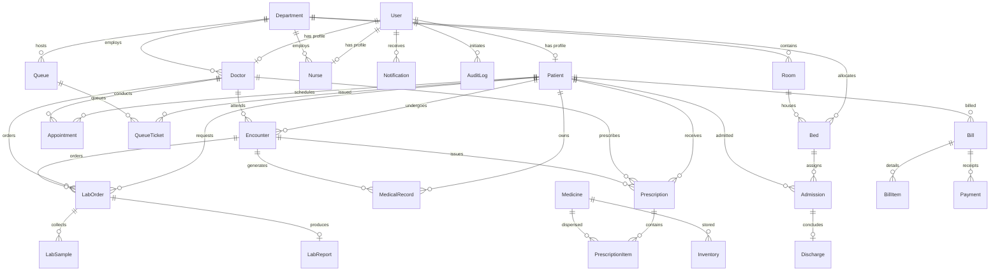

# HospitalOS — Database Architecture & Schema Specification

## 1. Overview

HospitalOS utilizes a relational PostgreSQL database orchestrated through **Prisma ORM**. The data model is strictly normalized (3NF), strongly typed, and enforces referential integrity with foreign key constraints, cascading policies, and operational audit indexing.

The database is defined in `packages/database/prisma/schema.prisma` and consists of **24+ interconnected clinical and operational models**.

---

## 2. Entity Relationship Overview

---

## 3. Core Models & Schemas

### 3.1 Identity & Access
- **`User`**: Core authentication record (`id`, `email`, `passwordHash`, `role`, `firstName`, `lastName`, `phone`, `isActive`, `createdAt`, `updatedAt`).
  - Roles: `ADMIN`, `DOCTOR`, `NURSE`, `RECEPTIONIST`, `LAB_STAFF`, `PHARMACY_STAFF`, `PATIENT`.

### 3.2 Clinical Personas
- **`Patient`**: Medical record profile (`id`, `userId`, `mrn` [Unique], `dateOfBirth`, `gender`, `bloodGroup`, `allergies`, `emergencyContact`, `status`).
  - Statuses: `REGISTERED`, `APPOINTMENT_SCHEDULED`, `CHECKED_IN`, `WAITING`, `CALLED`, `IN_CONSULTATION`, `LABORATORY`, `PHARMACY`, `BILLING`, `ADMITTED`, `DISCHARGED`.
- **`Doctor`**: Physician registry (`id`, `userId`, `departmentId`, `licenseNumber`, `specialization`, `consultationFee`, `isAvailable`).
- **`Nurse`**: Nursing staff registry (`id`, `userId`, `departmentId`, `shift`, `isAvailable`).

### 3.3 Operations & Flow
- **`Department`**: Hospital unit (`id`, `name`, `code`, `floor`, `wing`, `description`).
- **`Appointment`**: Visit booking (`id`, `patientId`, `doctorId`, `departmentId`, `appointmentDate`, `timeSlot`, `status`, `reason`).
- **`Queue`**: Waiting room line (`id`, `name`, `departmentId`, `status`, `currentNumber`).
- **`QueueTicket`**: Waiting token (`id`, `queueId`, `patientId`, `ticketNumber`, `status`, `priority`, `calledAt`, `estimatedWaitTime`).
- **`Encounter`**: Clinical consultation encounter (`id`, `patientId`, `doctorId`, `appointmentId`, `status`, `chiefComplaint`, `diagnosis`, `icdCode`, `vitalSigns`).

### 3.4 Inpatient & Facilities
- **`Room`**: Room infrastructure (`id`, `departmentId`, `roomNumber`, `type`, `floor`, `wing`).
- **`Bed`**: Bed matrix asset (`id`, `roomId`, `departmentId`, `bedNumber`, `type`, `status`).
  - Statuses: `AVAILABLE`, `OCCUPIED`, `RESERVED`, `CLEANING`, `MAINTENANCE`, `BLOCKED`.
- **`Admission`**: Inpatient stay (`id`, `patientId`, `bedId`, `departmentId`, `doctorId`, `admissionDate`, `status`, `initialDiagnosis`).
- **`Discharge`**: Concluded stay (`id`, `admissionId`, `dischargeDate`, `summary`, `condition`, `approvedBy`).

### 3.5 Diagnostics & Pharmacy
- **`LabOrder`**: Diagnostic order (`id`, `patientId`, `doctorId`, `testName`, `status`, `priority`).
- **`LabSample`**: Physical specimen (`id`, `labOrderId`, `barcode`, `sampleType`, `status`, `collectedAt`).
- **`LabReport`**: Pathology report (`id`, `labOrderId`, `reportNumber`, `findings`, `impression`, `status`, `publishedAt`).
- **`Medicine`**: Pharmaceutical drug entity (`id`, `name`, `genericName`, `sku`, `dosageForm`, `unitPrice`).
- **`Inventory`**: Stock batch management (`id`, `medicineId`, `batchNumber`, `quantity`, `reorderLevel`, `expiryDate`, `status`).
- **`Prescription`**: Order script (`id`, `patientId`, `doctorId`, `prescriptionNumber`, `status`).
- **`PrescriptionItem`**: Drug line item (`id`, `prescriptionId`, `medicineId`, `dosage`, `frequency`, `duration`, `quantity`).

### 3.6 Financial & Audit
- **`Bill`**: Consolidated financial invoice (`id`, `patientId`, `billNumber`, `totalAmount`, `paidAmount`, `status`).
- **`BillItem`**: Individual charge item (`id`, `billId`, `description`, `quantity`, `unitPrice`, `amount`).
- **`Payment`**: Transaction receipt (`id`, `billId`, `amount`, `paymentMethod`, `transactionRef`, `status`).
- **`HospitalEvent`**: Real-time event log for Digital Twin state stream (`id`, `eventType`, `aggregateType`, `aggregateId`, `payload`).
- **`AuditLog`**: Regulatory compliance trail (`id`, `userId`, `action`, `resource`, `resourceId`, `details`, `ipAddress`).
